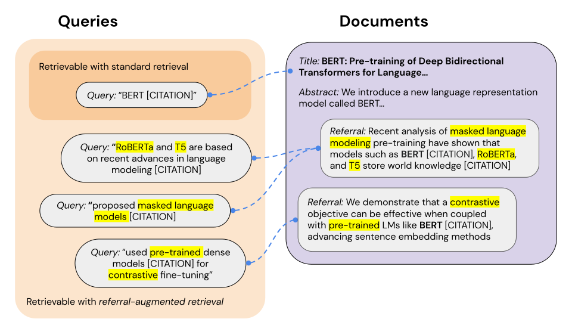

# Referral-augmented retrieval (RAR)



## Installation

Install with pip:
```
pip install referral-augment
```
Alternatively, install from source:
```
git clone https://github.com/michaelwilliamtang/referral-augment
cd referral-augment
pip install -r requirements.txt
pip install -e .
```

## Overview

Simple, general implementations of referral-augmented retrieval are provided in `rar.retrievers`. We support three aggregation methods — concatenation, mean, and shortest path — as described in the paper, which can be specified via an `AggregationType` constructor argument.

Under our framework, retrieval with BM25 is as simple as:
```python
from rar.retrievers import BM25Retriever
retriever = BM25Retriever(docs, referrals)
retriever.retrieve('paper that introduced the Flickr30k dataset', num_docs=10)
```
Similarly, retrieval with any dense embedding model on HuggingFace:
```python
from rar.retrievers import DenseRetriever, AggregationType
from rar.encoders import HuggingFaceEncoder
encoder = HuggingFaceEncoder('facebook/contriever')
retriever = DenseRetriever(encoder, docs, referrals, aggregation=AggregationType.MEAN)
retriever.retrieve('paper that introduced the Flickr30k dataset', num_docs=10)
```
For convenience, we also include direct implementations of the `SimCSEEncoder` and `SpecterEncoder`.

Example replications of paper results showing the advantage of referral augmentation and demonstrating a full, concise retrieval and evaluation pipeline can be found in `examples.ipynb`.

### Optional: install with SimCSE support

Note that the only stable version of SimCSE is currently using its [source](https://github.com/princeton-nlp/SimCSE) as a module, which requires building `rar` from source. Thus, optionally to install with support for `SimCSEEncoder`:
```
git clone https://github.com/michaelwilliamtang/referral-augment
cd referral-augment
pip install -r requirements.txt
cd src/rar/encoders
git clone https://github.com/princeton-nlp/SimCSE
cd SimCSE
pip install -r requirements.txt
cd ../../../..
```

## Data

We provide sample data in zipped form [here](https://drive.google.com/file/d/1IVo3sJ-H5i17KdQq4-kBr9oL64KLxtEc/view?usp=sharing) — to use, unzip and place `data/` under the repository's root directory.

Our sample data covers two domains, each with a *corpus* of documents and referrals and an evaluation *dataset* of queries and ground truth documents. Under the `paper_retrieval` domain, we include the `acl`, `acl_small`, and `arxiv` corpuses and datasets, and under the `entity_retrieval` domain, we include the `dbpedia_small` corpus and dataset.

Construction details:
- The `acl_small`, `acl`, and `arxiv` corpuses are constructed from the rich paper metadata parses provided by Allen AI's [S2ORC](https://github.com/allenai/s2orc) project. Documents consist of concatenated paper titles and abstracts from up-to-2017 ACL and ArXiv papers, respectively, and referrals consist of in-text citations between up-to-2017 papers. The respective evaluation datasets are also from the parses, consisting of in-text citations from *2018-and-on* papers citing the up-to-2017 papers in the corpus -- this time-based split prevents data leakage and mirrors deployment conditions.
- The `dbpedia_small` corpus and dataset is sampled from the DBPedia task in the [BEIR](https://github.com/beir-cellar/beir) benchmark. Referrals are mined from Wikipedia HTML using [WikiExtractor](https://github.com/attardi/wikiextractor).

Data can be loaded via our utility functions at `rar.utils`:
```python
from rar.utils import load_corpus, load_eval_dataset
docs, referrals = load_corpus(domain='paper_retrieval', corpus='acl_small')
queries, ground_truth = load_eval_dataset(domain='paper_retrieval', dataset='acl_small')
```
Our data representations are simple and intuitive:
— A `corpus` is a lists of document strings
— A set of `referrals` is a list of lists of document strings (one list of referrals per document)
Similarly:
— A set of `queries` is a lists of query strings
— The corresponding `ground_truth` is *either* a list of document strings (one ground truth document per query, e.g. the cited paper in paper retrieval) *or* a list of lists of document strings (multiple relevant ground truth documents per query, e.g. all relevant Wikipedia pages for a given `dbpedia_small` query)

### Custom data

Creating a corpus is as simple as constructing these lists (referrals are optional). For example:
```python
docs = ['Steve Jobs was a revolutionary technological thinker and designer', "Bill Gates founded the world's largest software company"]
referrals = [['Apple CEO', 'Magic Leap founder'], ['Microsoft CEO', 'The Giving Pledge co-founder']]

retriever = BM25Retriever(docs, referrals)
```
Creating an evaluation corpus is similarly easy:
```python
queries = ['Who built the Apple Macintosh?']
ground_truth = [docs[0]]
```

## Evaluation

We implement the Recall@k and MRR metrics under `rar.metrics`, which can be used standalone or with our utility functions at `rar.utils`:
```python
from rar.utils import evaluate_retriever
evaluate_retriever(retriever, queries, ground_truth)
```
By default, `evaluate_retrieval` attempts to compute MRR, Recall@1, and Recall@10 metrics. The keyword parameter `multiple_correct=False` removes MRR, since it does not support multiple ground truth documents per query (e.g. for `dbpedia_small`). See `examples.ipynb` for example outputs.

If you find this repository helpful, feel free to cite our publication [Referral Augmentation for Zero-Shot Information Retrieval](https://arxiv.org/abs/2305.15098):

```
@misc{tang2023referral,
      title={Referral Augmentation for Zero-Shot Information Retrieval}, 
      author={Michael Tang and Shunyu Yao and John Yang and Karthik Narasimhan},
      year={2023},
      eprint={2305.15098},
      archivePrefix={arXiv},
      primaryClass={cs.CL}
}
```
